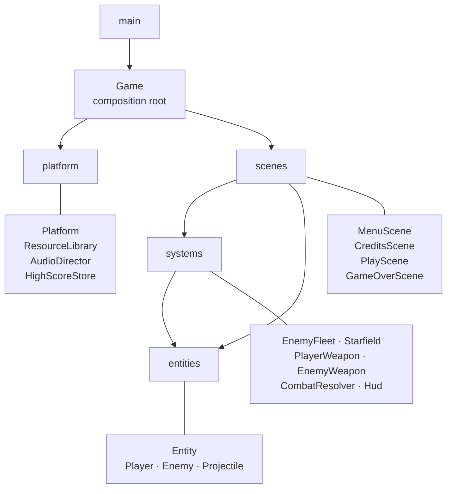

# The-Invasion-Game

[](https://www.repostatus.org/#active)
[](https://en.cppreference.com/w/cpp/17)
[](https://liballeg.org/)
[](https://cmake.org/)
[](https://emscripten.org/)
[](https://webassembly.org/)
[](https://www.khronos.org/webgl/)
[](https://github.com/liballeg/allegro5/blob/master/README_sdl.txt)
[](#quick-start)
[](#architecture)
[](#verification)
[](#gameplay)
[](LICENSE)

Classic arcade space shooter written from scratch in C++ with the
[Allegro 5](https://liballeg.org/) library. The game was originally built
during the author's first semester of university. This repository now holds
its object-oriented rewrite, which additionally runs in the browser through
WebAssembly and WebGL.

## Rewrite

The published source was a single 1,034-line `main()` containing four nested
`while` loops, supported by free functions operating on plain C structs and a
handful of file-scope globals. It has been rewritten as an object-oriented
code base organised along the single-responsibility principle: twenty-one
classes across five layers, each with one reason to change.

The rewrite is deliberately behaviour-preserving. Gameplay quirks were kept
even where they are arguably wrong — a single shot can still damage several
overlapping enemies in the same frame, for instance — so that the difficulty
curve remains the one the game was tuned around. Only outright defects were
corrected; they are listed under
[Defects fixed during the rewrite](#defects-fixed-during-the-rewrite).

| Aspect              | Before                                              | After                                                        |
|---------------------|-----------------------------------------------------|--------------------------------------------------------------|
| Structure           | One 1,034-line `main()`                             | 21 classes over 5 layers                                     |
| Control flow        | Four nested `while` loops                           | Scene contract with a single event loop                      |
| State               | File-scope globals and plain structs                | Encapsulated classes, shared state passed by reference       |
| Resource lifetime   | Manual teardown list at the end of `main()`         | RAII, non-copyable owners                                    |
| Build               | Visual Studio project, intermediates committed      | CMake for desktop, script for WebAssembly                    |
| Targets             | Windows                                             | Linux, Windows, browser                                      |

## Architecture



| Layer       | Responsibility                                                                   |
|-------------|----------------------------------------------------------------------------------|
| `core`      | World constants, shared context, composition root, event loop and transitions.   |
| `entities`  | Things that occupy space: position, extent and their own rules.                  |
| `systems`   | Simulation and presentation of groups: fleet, weapons, background, interface.    |
| `scenes`    | One class per screen, each answering only for itself.                            |
| `platform`  | Allegro lifecycle, asset ownership, audio and score persistence.                 |

### Design notes

**Scenes replace nested loops.** Every screen implements the `Scene`
contract; `Game` owns the single event loop and decides transitions. Screens
declare their own redraw policy, because menu, credits and game over redraw
on each pass — which is what sets the cadence of their blinking prompt —
while the match waits for the input queue to drain.

**Ownership is explicit.** `ResourceLibrary` and `AudioDirector` are
non-copyable and release their handles in their destructors, replacing the
forty-line teardown sequence at the end of the original `main()`.

**Asymmetric collision rules stay where they belong.** `Entity::intersects`
implements the symmetric axis-aligned bounding box test used by the player,
enemy projectiles and projectile interception. Enemy hit detection and enemy
crowding use different, lopsided formulas in the original; those remain in
`Enemy` and `EnemyFleet` rather than being flattened into a single helper
that would silently change the game's feel.

## Defects fixed during the rewrite

| Defect                                                              | Effect                                                                       |
|---------------------------------------------------------------------|------------------------------------------------------------------------------|
| `Personagens.h` declared `Enimies`; the source used `Enemies` in 15 places | The published source did not compile at all, on any compiler.            |
| `Powers missile[3]` initialised with ten elements                   | Wrote seven elements past the end of a stack buffer.                         |
| `chance -= 50 * score / count / 10` with no lower bound             | Reached zero at high scores, so `rand() % chance` divided by zero and crashed.|
| Nine ship sprites reloaded per match, never released                | Leak that grew with every round played.                                      |
| Animation counter initialised to 9, outside the 0–8 draw range      | Ship invisible for the first twenty frames of every match.                   |
| `exposion_time` and `moving_timer` created, never started or freed  | Leaked timers and dead code.                                                 |
| Header encoded ISO-8859-1 while the source was UTF-8                | Rejected by compilers stricter than MSVC.                                    |

### Adapted for the browser

Three further changes were needed for the game to behave correctly outside
its original environment.

| Change                                                            | Reason                                                                                                                                                                  |
|-------------------------------------------------------------------|--------------------------------------------------------------------------------------------------------------------------------------------------------------------------|
| `VORBISFILE_LIBRARY` pointed at Emscripten's combined archive     | Allegro looks for a separate `libvorbisfile`; the Emscripten port ships vorbis, vorbisenc and vorbisfile in one archive. Without it, acodec silently dropped Ogg Vorbis.  |
| Frame order moved from *draw, flip, clear* to *clear, draw, flip* | WebGL has no true double buffer. The browser composites whatever the drawing buffer holds at its next repaint, so clearing right after the flip presented a blank frame.   |
| Every screen redraws once per clock tick                          | Menu, credits and game over redrew on every pass of their loops, which issues several buffer swaps per browser repaint and flickers.                                      |
| Mix levels rebalanced                                             | The tracks were set to 0.01 and 0.008 against a beep at 1.0, leaving the music roughly a hundred times quieter than the interface click.                                   |

## Verification

The rewrite is checked at three levels before it is considered sound:

- compilation of all twenty-one translation units under `-Wall -Wextra`,
  with no errors and no warnings;
- a link against a stub implementation of the Allegro surface actually used,
  which catches declared-but-undefined members; and
- a full CMake build and link against Allegro 5.2.11 on the desktop.

## Gameplay

Survive endless waves of invading ships. Each kill raises the score, and the
fleet grows and toughens as it climbs. The player has three lives.

| Key               | Action                    |
|-------------------|---------------------------|
| `W` `A` `S` `D`   | Move the ship             |
| `Space`           | Fire                      |
| `Enter` / `Space` | Confirm in menus          |
| `Esc`             | Return to the main menu   |

The best score persists between sessions: in a file on the desktop, and in
IndexedDB in the browser.

## Quick start

### Desktop

Requires CMake, a C++17 compiler and Allegro 5.

```bash
sudo pacman -S cmake allegro          # Arch Linux
cd "The Invasion"
cmake -B build -DCMAKE_BUILD_TYPE=Release
cmake --build build -j
./the_invasion
```

The binary is written next to `Assets/`, `fonts/` and `sounds/`, because
asset paths are resolved relative to the working directory.

### Windows

Under MSYS2, mirroring the steps above:

```bash
pacman -S mingw-w64-ucrt-x86_64-{cmake,gcc,allegro}
cd "The Invasion"
cmake -B build -G Ninja -DCMAKE_BUILD_TYPE=Release
cmake --build build
./the_invasion.exe
```

With MSVC, install Allegro through [vcpkg](https://vcpkg.io/) and point
CMake at its toolchain file:

```powershell
vcpkg install allegro5:x64-windows
cd "The Invasion"
cmake -B build -DCMAKE_TOOLCHAIN_FILE=<vcpkg>/scripts/buildsystems/vcpkg.cmake
cmake --build build --config Release
```

### Arch Linux package

A PKGBUILD is provided, so the game can be installed and removed through
`pacman` like any other package:

```bash
cd packaging/arch
makepkg -si
the-invasion
```

The package installs the binary to `/usr/bin/the-invasion`, its data to
`/usr/share/the-invasion`, and a desktop entry so it appears in the
application menu. Because `/usr/share` is read only, installed builds keep
the high score under `$XDG_DATA_HOME/the-invasion/` instead.

### Browser

Requires Emscripten.

```bash
sudo pacman -S emscripten             # Arch Linux
./web/build.sh
cd web/dist && python3 -m http.server 8080
```

Then open <http://localhost:8080>.

Allegro has no Emscripten backend of its own, so the build compiles it
against its **SDL2 backend**, the route documented upstream in
`README_sdl.txt`. Three settings carry the port:

| Setting                                        | Purpose                                                                 |
|------------------------------------------------|--------------------------------------------------------------------------|
| `-sASYNCIFY` with `-DALLEGRO_WAIT_EVENT_SLEEP=ON` | Lets `al_wait_for_event` yield to the browser, so the blocking event loop works unchanged. |
| `-sUSE_VORBIS=1 -sUSE_OGG=1`                   | Provide the codecs for the `.ogg` soundtrack.                            |
| `--preload-file`                               | Packs sprites, fonts and audio into the virtual filesystem.              |

Browsers keep the audio context suspended until the first user gesture, so
the soundtrack starts on the first key press rather than on page load.

## Repository layout

```
.
├── README.md
├── LICENSE
├── packaging/
│   └── arch/              PKGBUILD and desktop entry
├── The Invasion/
│   ├── CMakeLists.txt
│   ├── Assets/            Sprites, including the player ship frames
│   ├── fonts/             Title, button and score typefaces
│   ├── sounds/            Menu and battle tracks, interface beep
│   └── src/
│       ├── main.cpp
│       ├── core/          Config, GameContext, Game
│       ├── entities/      Entity, Player, Enemy, Projectile
│       ├── systems/       Starfield, EnemyFleet, weapons, CombatResolver, Hud
│       ├── scenes/        Scene contract and the four screens
│       └── platform/      Platform, ResourceLibrary, AudioDirector,
│                          HighScoreStore, Paths
└── web/
    ├── build.sh           Builds Allegro for wasm, then the game
    └── shell.html         Page hosting the canvas
```

Headers are included relative to `src/`, for example
`#include "systems/EnemyFleet.h"`.

## Status

All three targets are complete and verified. The desktop build compiles and
links against Allegro 5.2.11 with no warnings. The browser build produces a
2.9 MB WebAssembly module with a 15 MB asset package, and has been played
end to end: the menu, the starfield, both enemy variants, the crowding
behaviour, firing, the HUD and the Ogg Vorbis soundtrack all work. The Arch
package builds from the PKGBUILD under `packaging/arch/`.

## License

Released under the [MIT License](LICENSE).

## Credits

| Role                       | Name                                |
|----------------------------|-------------------------------------|
| Programming, game design   | **Anderson Gonçalves**              |
| Art                        | **Anderson Gonçalves**, **Hugo City** |
